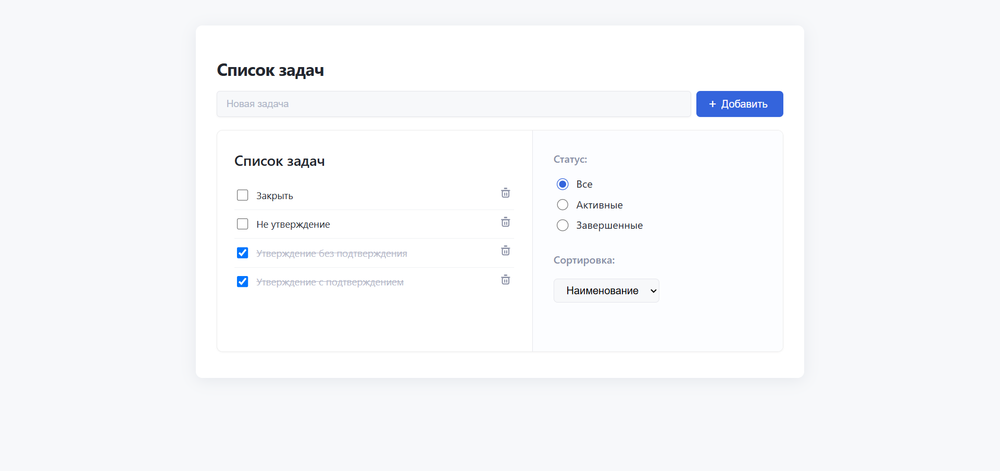
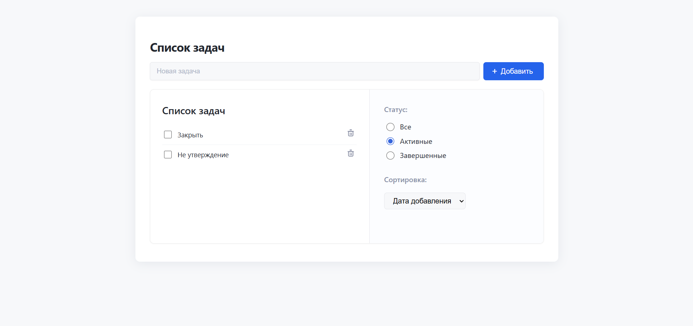
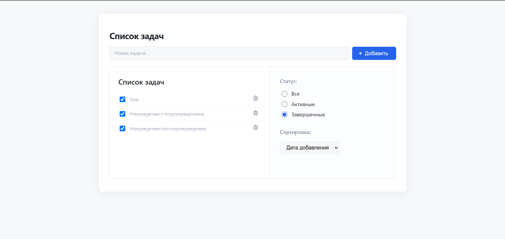
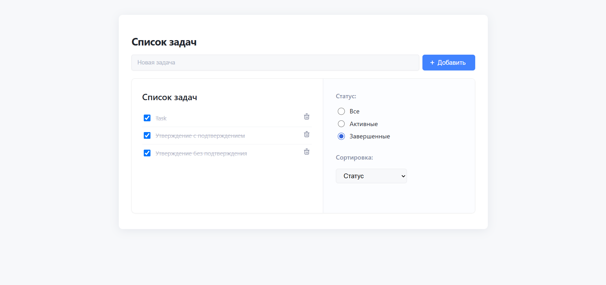
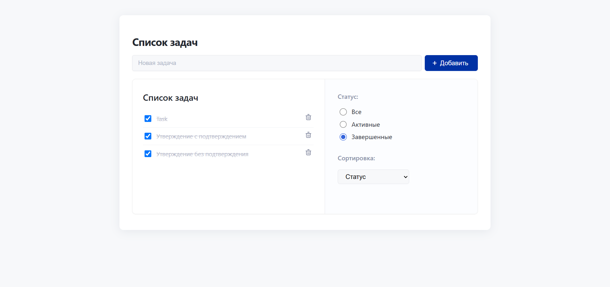

# Todo App

<p align="center">
  
</p>
<p align="center"><i>Главная страница приложения: удобный и современный интерфейс</i></p>

**Todo App** — это современное и интуитивно понятное приложение для эффективного управления вашими задачами. Построено на базе React и Redux Toolkit, оно сочетает минимализм, скорость и расширенные возможности сортировки и фильтрации.

---

## Основные возможности

- Мгновенное добавление, выполнение и удаление задач
- Фильтрация задач по статусу: все, активные, выполненные
- Гибкая сортировка: по дате создания, по имени или по статусу
- Автоматическая расстановка: новые задачи всегда сверху, выполненные — внизу списка
- Современный дизайн с поддержкой светлой и тёмной темы
- Анимации и плавные изменения цвета кнопок при наведении и нажатии

---

## Скриншоты

<div align="center">
  
  <br/>
  <i>Рисунок 1. Главный экран: список ваших задач</i>
  <br/><br/>
  
  
  <br/>
  <i>Рисунок 2. Фильтрация: отображайте только активные или только выполненные задачи</i>
  <br/><br/>
  
  
  <br/>
  <i>Рисунок 3. Сортировка: выберите удобный для себя порядок задач</i>
  <br/><br/>
  
  
  <br/>
  <i>Рисунок 4. Кнопка при наведении: визуальный отклик для пользователя</i>
  <br/><br/>
  
  
  <br/>
  <i>Рисунок 5. Кнопка при нажатии: изменение цвета для подтверждения действия</i>
</div>

---

## Быстрый старт

```bash
git clone https://github.com/katarymba/your-todo-app.git
cd your-todo-app
npm install
npm start
```

---

## Структура проекта

```
src/
 ├─ components/     # Компоненты интерфейса
 ├─ features/       # Redux-slices и логика приложения
 ├─ store/          # Redux store
 ├─ types/          # Общие типы
 ├─ App.tsx         # Главный компонент
 └─ index.tsx       # Точка входа
public/
 └─ screenshots/    # Скриншоты для README
```

---

## Используемые технологии

- React
- Redux Toolkit
- TypeScript
- CSS Modules

---

## Взаимодействие с кнопками

- **Наведение:** При наведении курсора на кнопку её цвет плавно меняется — см. рисунок 4.
- **Нажатие:** При нажатии кнопка изменяет цвет, подтверждая ваше действие — см. рисунок 5.

---

## Обратная связь и поддержка

Автор: [@katarymba](https://github.com/katarymba)